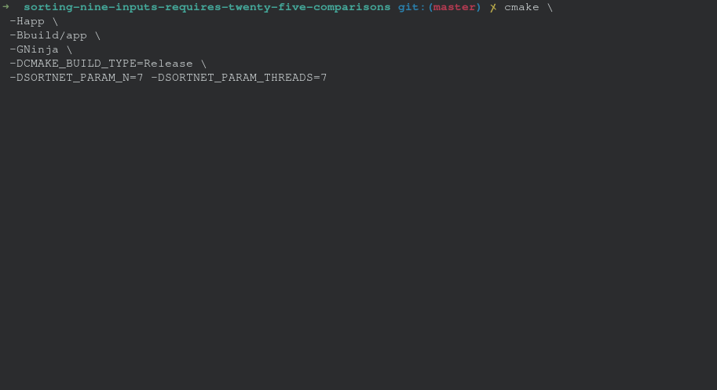
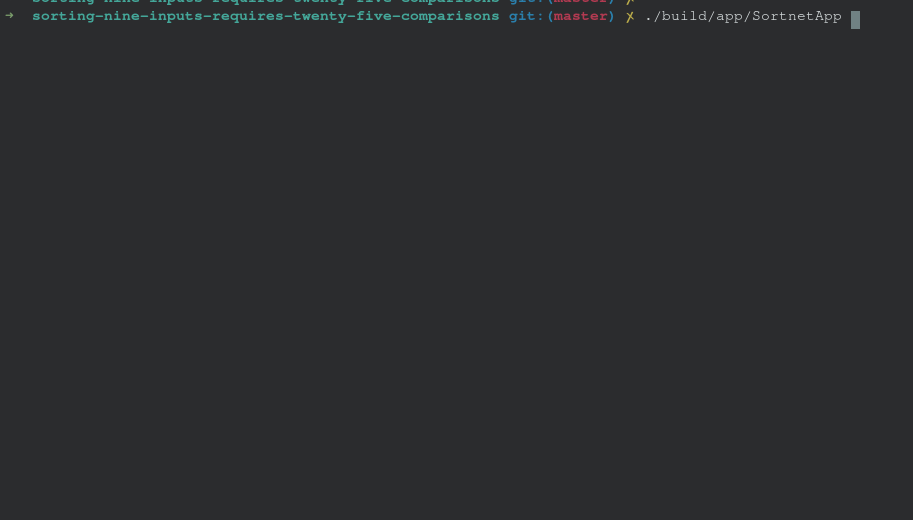
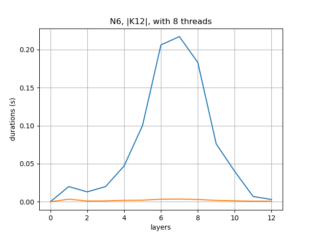
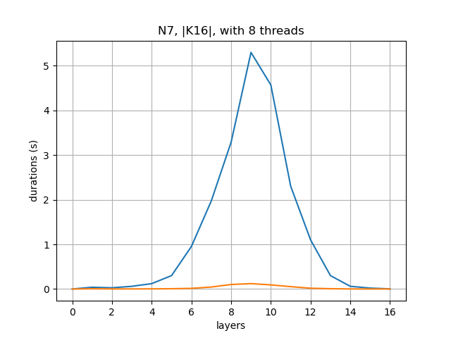
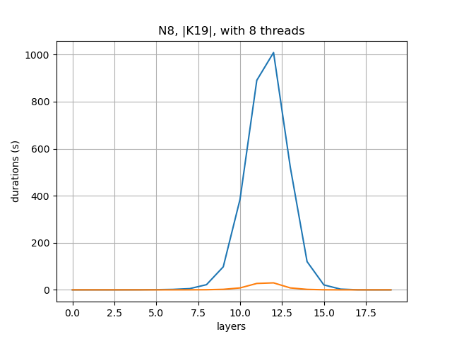
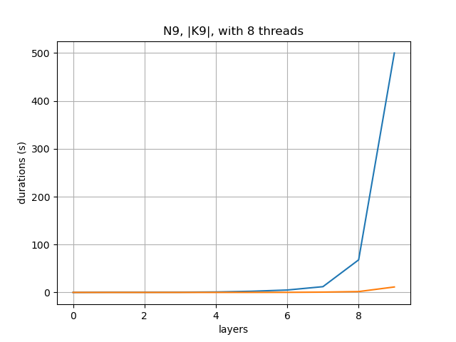

[](https://github.com/andersfylling/sorting-nine-inputs-requires-twenty-five-comparisons/actions)
[](https://github.com/andersfylling/sorting-nine-inputs-requires-twenty-five-comparisons/actions)
[](https://github.com/andersfylling/sorting-nine-inputs-requires-twenty-five-comparisons/actions)
[](https://github.com/andersfylling/sorting-nine-inputs-requires-twenty-five-comparisons/actions)
[](https://codecov.io/gh/andersfylling/sorting-nine-inputs-requires-twenty-five-comparisons)

# About
This is a **third-party** implementation of the paper ["*Sorting nine inputs requires twenty-five comparisons*"](https://www.sciencedirect.com/science/article/pii/S0022000015001397) [1] in c++. It exists to make a reliable reference point for future projects that needs to measure the runtime reduction of their ideas/findings, with regards to [the minimum comparator network size problem](https://en.wikipedia.org/wiki/Sorting_network) [3]. All I ask is that you reference this project when you are using it for your measurements. Especially given that others can also verify your numbers.

This project is considered feature complete as the core methods are implemented in a naive/simple manner of their prolog version. However, code design, naming, or anything that improves readability are changes of interest. 

> You must use gcc10 or clang10 to compile this

## Features

- Multi-threading
- Scalable memory usage
- Minimal heap allocations
- Test suite
- Components as a static library (CPM supported)

## Running for different variables

The variables N, K, Threads can be set before compiling the project with the following cmake params:
 - SORTNET_PARAM_N
 - SORTNET_PARAM_K
 - SORTNET_PARAM_THREADS
 
#### Example
The application can be build for the given parameters listed above using CMake params, as seen below. This program will then run until the first sorting network is discovered.
```bash
cmake \
 -Happ \
 -Bbuild/app \
 -GNinja \
 -DCMAKE_BUILD_TYPE=Release \
 -DSORTNET_PARAM_N=8 \
 -DSORTNET_PARAM_THREADS=4
 
ninja --C build/app

./build/app/Sortnet
```

##### Building and running N7


##### Running N8


## Benchmarks

> Blue for Prolog, and orange for c++.
<p align="center">


</p>
<p align="center">


</p>


For N9 the program was stopped before N9K10 could finish due to time. Regardless, we see that the c++ implementation has superior runtime. There might be several factors to this, the most obvious being a gain in control over the codeflow, reduced overhead. I can't speak for the compiler, as I am no prolog expert.

## Code flow

#### Background
The goal of this problem is two fold; find a sorting network, and prove that there does not exist a sorting network of smaller size. This is relevant to the sequence size N, such that the problem space exists per N sequence. So far only N9 (a sequence of 9 elements) have been computed [1]. However, it was written in a high level language which adds serious cost to the runtime. This project re-implements the logic in C++ - which is a faster language than Prolog.

#### Walkthrough

In order to do prove that the found network is of the smallest size in the search space, a weak proof algorithm is implemented. To explore every possible configuration of comparator networks, a [breadth first search](https://en.wikipedia.org/wiki/Breadth-first_search) [4] is implemented. The root node is a empty network and every branch added is a unique comparator. The same comparator can be re-used across layers. The breadth first search is continued until a sorting network is discovered. Since every comparator network so far have been explored, we know that the newly found sorting network is the minimum size.

As mentioned in the paper [1] there are ways to prune our search, which makes N values above 5 feasible. Using the [zero-one principle](http://www.euroinformatica.ro/documentation/programming/!!!Algorithms_CORMEN!!!/DDU0170.html) [5] a output set for a given network can be computed, by checking for subsumptions between networks using these output sets we can discover redundant network, which can be pruned.

The idea is that when two sets are equal or one subsumes the other, the sets would require the same configurations of comparators in order to become completely sorted. As such, millions upon billions of cases for larger N values can be ignored. It is imperative to keep in mind the importance of finding the sorting network with the fewest comparators, rather than the combinations of independent comparators that shapes the network.

Further, more symmetries can be detect by using permutations on the output sets as stated in the paper [1]. Which allows a significantly higher amount of networks to be pruned. Which becomes a crucial step in order to tackle higher N values (>8).

#### Generate and Prune approach

The generate and prune approach, consists of two phases; generateing the networks and their output sets for a specific layer, and pruning away the redundant networks and their output sets. This is the basic concept that continuously explores the search space until a sorting network is found. The paper [1] identifies preconditions for subsumption before a permutation is applied. Significantly reducing the number of complete subsumption tests. These are referred to as ST1, ST2, ST3 in the code.

Sticking with the concept of segments throughout the code base, it becomes easier to see how memory is saved and to visualize the multithreading behaviour. Once work is done on a segment, the result or updated segment is written it's own file. Networks and output sets do not share the same file, but merely a segment ID to allow decoupling and reduce overall IO calls.

### Multi-threading

The process of computing each layer can be split up into 3 parts; generating, pruning within segments (files) and pruning across segments (files). The generator phase is single threaded as it only wastes a few minutes on N9, while the multi-threaded pruning phases can take several hours to complete for a single layer.

_Pruning within segments (files)_ tells each thread to work on a single segment. Since segments are isolated from each other, there is no need for synchronization between threads. However, the implementation quickly becomes IO bound as the number of sets/networks reduces per segment on N9 as each segment needs to be read and written to disk as the code progresses. But as N increases the complexity of pruning may go beyond the IO penalties. Unless a dedicated high performance NVMe disk is utilised, reducing IO wait time would be a significant speed up.


_Pruning across segments (files)_ have the same issue with IO, but must also share memory across threads. After talking with an author from the paper [1] the approach was to mark one segment as read only, and the remaining segments as writeable. Then all threads can see the read-able segment, but a write-able segment is isolated to the thread only - aka the threads has total ownership to avoid needs for synchronization.

Once every write-able segment has been compared to the read-only segment, the process selects a different segment to be marked as read-only and the rest as write-able. Thanks to this, every output set is correctly compared across segments without the need for synchronization between jobs.


## Contributing

### Build and run test suite

Use the following commands from the project's root directory to run the test suite.

```bash
cmake -Htest -Bbuild/test
cmake --build build/test
CTEST_OUTPUT_ON_FAILURE=1 cmake --build build/test --target test

# or simply call the executable: 
./build/test/SortnetTests
```

To collect code coverage information, run CMake with the `-DENABLE_TEST_COVERAGE=1` option.

### Run clang-format

Use the following commands from the project's root directory to run clang-format (must be installed on the host system).

```bash
cmake -Htest -Bbuild/test

# view changes
cmake --build build/test --target format

# apply changes
cmake --build build/test --target fix-format
```

See [Format.cmake](https://github.com/TheLartians/Format.cmake) for more options.

## Thanks to

 - Luís Cruz-Filipe for thorough explanation of the concepts and how the pruning steps functions in Prolog, which is consider critical insight to me. Especially lemma 6, which has been interpreted as exploring all permutations N!, while the prolog implementation explores those generated from the partition masks - which is crucial for scaling (increasing N).


## References

 - [1] https://www.sciencedirect.com/science/article/pii/S0022000015001397
 - [3] https://en.wikipedia.org/wiki/Sorting_network
 - [4] https://en.wikipedia.org/wiki/Breadth-first_search
 - [5] http://www.euroinformatica.ro/documentation/programming/!!!Algorithms_CORMEN!!!/DDU0170.html
